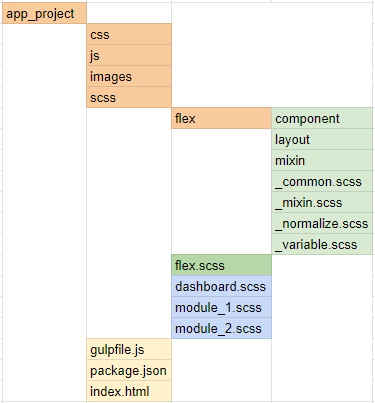

# Gulp Configuration for SCSS.

This configuration setup for gulp 4. 
1. Open command prompt and Move to app path
2. Create package.json file by using npm init
3. Install Global gulp:
```
npm install gulp --save-dev
```
4. Install additional plugins based on usage. The following table contains list of additional useful plugins.

Additional plugin | Purpose 
---|---
gulp-sass | Compiling sass to css 
gulp-minify | Minifying css file 
gulp-cssnano | Concatenate css files 
gulp-if | Add condition to the flow 
gulp-uglify | Concatenate the files instead of using gulp-concat 
gulp-useref | File concatenation but not minification 
gulp-sourcemaps | Getting line numbers in browser 
gulp-rename | Renamed the files 
gulp-livereload | Reload the css file and page 
gulp-strip-comments | Removes comments from JSON, JavaScript, CSS, HTML, etc.
gulp-plumber | When you are using task runner. if there is an error, that process will be stop, again need to restart. This plumber slove this issue, no need to restart and this return error in console.
gulp-util |  We can log the error to the terminal
browser-sync | Live reload the page when you change the configurated gulp files.
#### npm commands
~~~
npm install gulp-sass --save-dev 
npm install gulp-minify-css --save-dev 
npm install gulp-cssnano --save-dev 
npm install gulp-if --save-dev 
npm install gulp-uglify --save-dev 
npm install gulp-useref --save-dev 
npm install gulp-sourcemaps --save-dev 
npm install gulp-rename --save-dev 
npm install gulp-strip-comments --save-dev
npm install gulp-plumber --save-dev 
npm install gulp-util --save-dev 
npm install browser-sync --save-dev 
~~~

#### Single Line Installation:
~~~
npm install gulp --save-dev npm install gulp-sass --save-dev npm install gulp-minify-css --save-dev npm install gulp-cssnano --save-dev npm install gulp-if --save-dev npm install gulp-uglify --save-dev npm install gulp-useref --save-dev npm install gulp-sourcemaps --save-dev npm install gulp-rename --save-dev npm install gulp-strip-comments --save-dev npm install gulp-plumber --save-dev npm install gulp-util --save-dev npm install browser-sync --save-dev 
~~~

### Gulp Configuration

Crate gulpfile.js and Include the plugins in your gulp configuration file.

```javascript
var gulp = require('gulp');
// sass conversion
var sass = require('gulp-sass');
// Minify conversion
var minifyCss = require('gulp-minify-css');
var sourcemaps = require('gulp-sourcemaps');
var uglify = require('gulp-uglify');
var rename = require('gulp-rename');
// error log
var plumber = require('gulp-plumber');
var gutil = require('gulp-util');
```

Create the gulp task for css and javascript files. This task will generated minified files for production.

```javascript
//CSS file
gulp.task('css-dashboard', function () {
    return gulp.src('scss/dashboard.scss')
        .pipe(plumber({
            errorHandler: onError
        }))
        .pipe(sourcemaps.init())
        .pipe(sass())
        .pipe(gulp.dest('css/'))
        .pipe(minifyCss())
        .pipe(rename({
            suffix: '.min'
        }))
        .pipe(sourcemaps.write('.', {
            includeContent: false,
            sourceRoot: 'scss/'
        }))
        .pipe(gulp.dest('css/'))
});
```

The above css task generate both minified and css file. You can change the destination path and rename the file.
browser sync server config and port number we can change.

```javascript
//Javascript file
gulp.task('js-app', function () {
    return gulp.src('js/app.js')
        .pipe(plumber({
            errorHandler: onError
        }))
        .pipe(sourcemaps.init())
        .pipe(uglify())
        .pipe(rename({
            suffix: '.min'
        }))
        .pipe(gulp.dest('js/'));
});
```
The above javascript task generate minified javascript file.

#### Gulp watch
```
// Error handler
var onError = function (err) {
    gutil.beep();
    console.log(err);
};

//sass watcher
gulp.task('watch', function () {
    gulp.watch('scss/dashboard.scss', gulp.series('css-dashboard'));
    gulp.watch('js/app.js', gulp.series('js-app'));
})
```
Gulp tasks need to include in gulp watch. Whenever changing the souce files, the watcher will trigger and task will execute.

#### Comment for running Gulp:
```
gulp watch
```


#### SCSS folder setup

